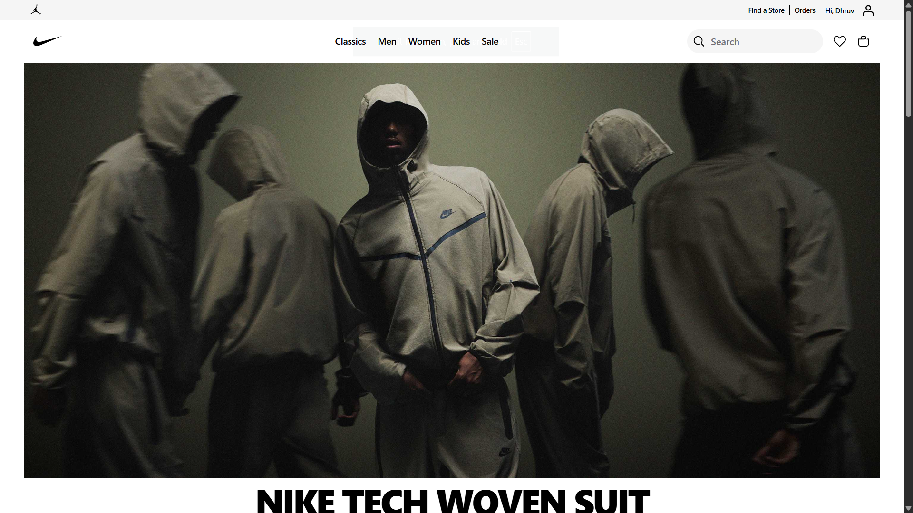
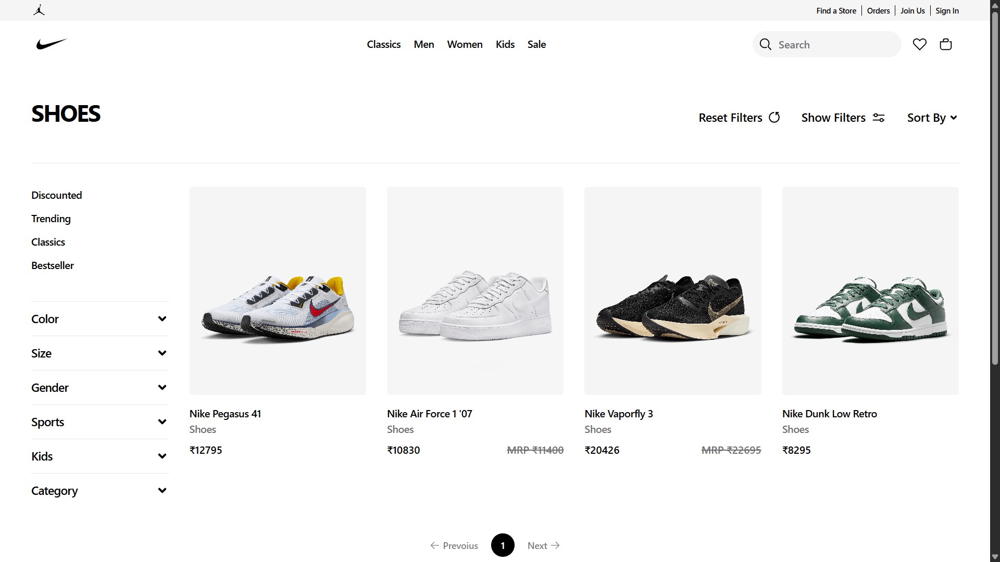
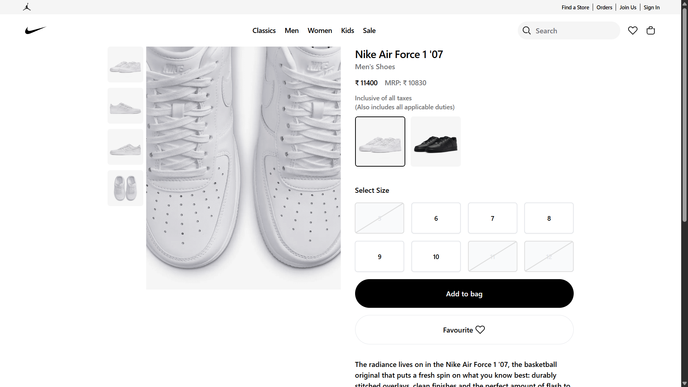
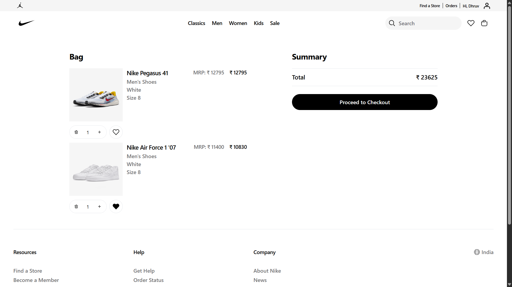
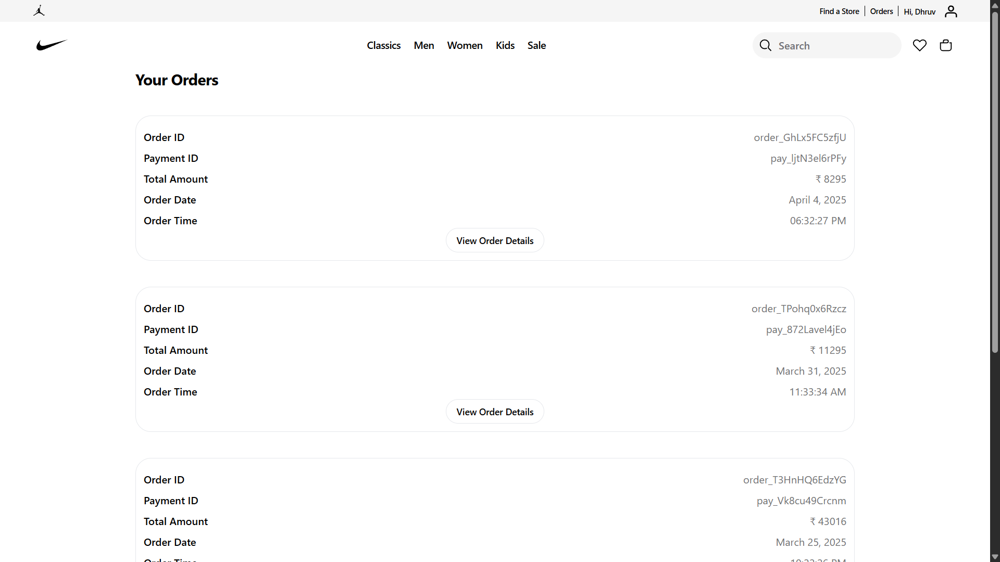

<h1>🏀 Nike Clone – MERN Stack E-commerce Application</h1>

A full-stack e-commerce web application inspired by Nike's official website, built using the MERN (MongoDB, Express.js, React.js, Node.js) stack. This project showcases a responsive design, user authentication, product management, and a seamless shopping experience.

<h2>🚀 Features</h2>
<ul>
  <li><strong>User Authentication</strong>: Secure login and registration using JWT.</li>
  <li><strong>Product Management</strong>: Browse, search, and filter products.</li>
  <li><strong>Shopping Cart</strong>: Add, remove, and manage items in the cart.</li>
  <li><strong>Order Processing</strong>: Place orders and view order history.</li>
  <li><strong>Admin Panel</strong>: Manage products, users, and orders.</li>
  <li><strong>Responsive Design</strong>: Optimized for desktop and mobile devices.</li>
</ul>

<h2>📸 Screenshots</h2>

<strong>🏠 Homepage</strong>

<strong>🛍️ Product Listing</strong>

<strong>📄 Product Details</strong>

<strong>🛒 Shopping Cart</strong>

<strong>📱 Orders</strong>

<h2>🛠️ Tech Stack</h2>
<ul>
  <li><strong>Frontend</strong>: React.js, Redux, Tailwind CSS</li>
  <li><strong>Backend</strong>: Node.js, Express.js</li>
  <li><strong>Database</strong>: MongoDB</li>
  <li><strong>Authentication</strong>: JSON Web Tokens (JWT)</li>
  <li><strong>Payment Gateway</strong>: Stripe</li>
</ul>
